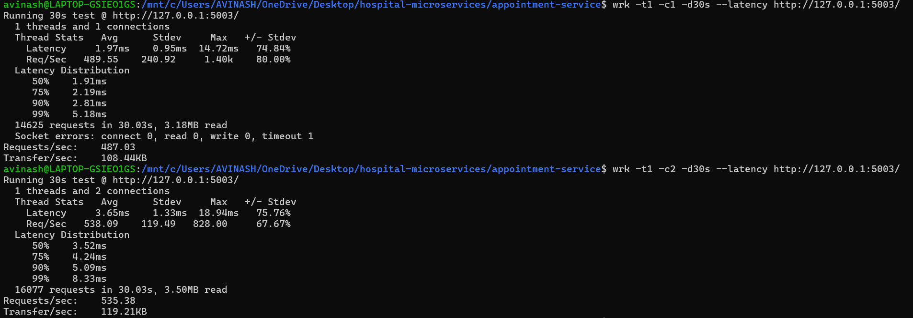
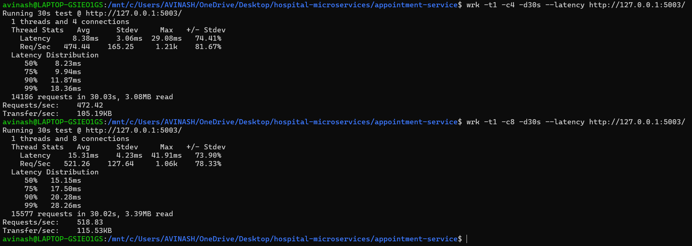
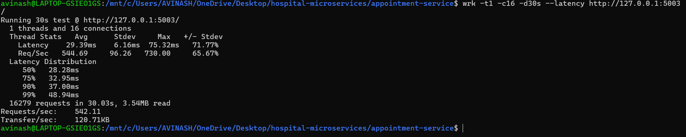

# Hospital Microservices

A containerized hospital management application developed using three independent microservices: Patient Service, Doctor Service, and Appointment Service.

The project demonstrates microservice development, Docker containerization, service-to-service communication, workload testing, resource monitoring, and performance analysis under different workload levels.

## 2. Objectives

- Develop three independent microservices.
- Implement REST APIs for the services.
- Containerize each microservice using Docker.
- Establish communication between the services.
- Deploy the services as separate containers.
- Generate different workload levels.
- Measure response time and throughput.
- Monitor CPU and memory utilization.
- Analyze application performance under increasing concurrency.

  ## 3. System Architecture

                         Client
                           |
                           v
                +----------------------+
                | Appointment Service  |
                |      Port 5003       |
                +----------+-----------+
                           |
                 +---------+---------+
                 |                   |
                 v                   v
        +----------------+   +----------------+
        | Patient Service|   | Doctor Service |
        |    Port 5001   |   |    Port 5002   |
        +----------------+   +----------------+

## 4. Microservices

### Patient Service

- **Port:** 5001
- **Purpose:** Manages patient information.
- **Technology:** Flask
- **Docker Container:** `patient-container`

### Doctor Service

- **Port:** 5002
- **Purpose:** Manages doctor information.
- **Technology:** Flask
- **Docker Container:** `doctor-container`

### Appointment Service

- **Port:** 5003
- **Purpose:** Manages appointments and communicates with the Patient and Doctor Services.
- **Technology:** Flask
- **Docker Container:** `appointment-container`

## 5. Technologies Used

- **Python** — Microservice development
- **Flask** — REST API development
- **Docker** — Containerization and deployment
- **Docker Network** — Communication between microservices
- **Ubuntu WSL** — Workload testing environment
- **wrk** — Load and workload testing

## 6. Docker Deployment

Each microservice was containerized and run as a separate Docker container.

### Docker Images

- `patient-service`
- `doctor-service`
- `appointment-service`

### Docker Containers

- `patient-container`
- `doctor-container`
- `appointment-container`

### Docker Network

The three containers were connected using the Docker network:

`hospital-network`

The Docker network allows the services to communicate with each other using their container names.

## 7. Service-to-Service Communication

The communication was tested using the following endpoint:

```text
http://127.0.0.1:5003/appointment-details/1/1
```

 Response
```text
{
  "doctor": {
    "available": true,
    "id": 1,
    "name": "Dr. Kumar",
    "specialization": "Cardiology"
  },
  "patient": {
    "age": 25,
    "gender": "Male",
    "id": 1,
    "name": "Rahul"
  }
}

```

## 8. Workload Testing

The Appointment Service was selected for workload testing.

The `wrk` load-testing tool was used to generate different levels of concurrent requests.

Five workload levels were tested:

| Workload | Concurrent Requests |
|----------|---------------------|
| W1 | 1 |
| W2 | 2 |
| W3 | 4 |
| W4 | 8 |
| W5 | 16 |

Each workload was tested for 30 seconds.

The number of threads was kept at 1 while the number of concurrent requests was varied.
## 9. Performance Results

The workload tests produced the following results:

| Workload | Concurrent Requests | Average Response Time (ms) | Throughput (req/s) | Failed Requests |
|----------|---------------------|----------------------------|---------------------|-----------------|
| W1 | 1 | 1.97 | 487.03 | 1 |
| W2 | 2 | 3.65 | 535.38 | 0 |
| W3 | 4 | 8.38 | 472.42 | 0 |
| W4 | 8 | 15.31 | 518.83 | 0 |
| W5 | 16 | 29.39 | 542.11 | 0 |

## 10. Workload Test Results

### W1 and W2



### W3 and W4



### W5


